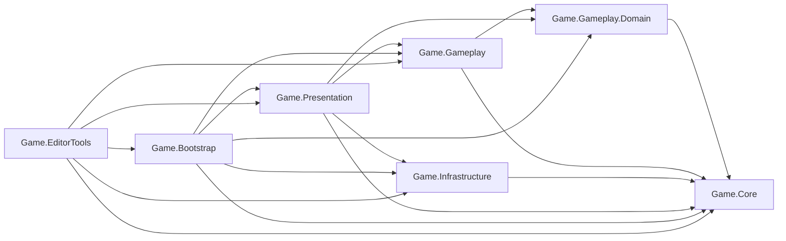

# Last Seed Survivor

An architecture-first 2D mobile auto-shooter built with Unity `6000.3.5f2` and C#.

The project is a production-oriented gameplay engineering sample focused on explicit dependency boundaries, reusable domain services, deterministic reward and balance logic, transactional pooled lifecycles, segmented enemy simulation, and testable Unity integration.

**Status:** active development. The current `master` baseline passes the project build, `299` EditMode tests, `29` PlayMode tests, configuration validation, serialized-reference validation, and Zenject validation for all three enabled build scenes.

[Portfolio](https://tokarevdev.github.io/) · [Gameplay video](https://youtube.com/shorts/HiQBlYjienI?feature=share) · [Privacy policy](docs/legal/privacy-policy.html)

## Gameplay

The player moves horizontally while weapons fire automatically at a segmented worm travelling along an authored rail path.

- Worm sections have independent health and may contain reward cocoons.
- Destroying a reward section pauses the combat flow and opens a three-choice upgrade popup.
- The main projectile weapon supports damage, fire-rate, critical, penetration, salvo, projectile-speed, and parallel-shot progression.
- Acacia Thorn is an unlockable secondary weapon with splitting, bouncing, salvos, critical progression, and its own pooled projectile lifecycle.
- Reward selection supports rarity pools, category uniqueness, guaranteed rarity, rerolls, rewarded-ad rerolls, take-all, and weaker-weapon DPS bias.
- If the worm reaches the end of its path, the player can use the guarded revive flow or give up and return to the lobby.
- A completed run can be restarted without reloading stale gameplay state.

Input is sampled once per rendered frame. Keyboard movement and normalized touch-drag input are converted into one immutable snapshot before gameplay systems consume it.

## Engineering goals

Last Seed is deliberately structured as more than a playable prototype. Its code is designed around several production constraints:

- Unity objects remain thin engine-facing adapters where practical.
- Domain state and deterministic calculations are ordinary C# types.
- Composition roots describe bindings without runtime service location.
- Shared operations are extracted only when they own a coherent responsibility or have real consumers.
- Runtime systems explicitly own initialization, subscriptions, cancellation, rollback, and cleanup.
- Frequently created gameplay objects use bounded, observable pooling lifecycles.
- Editor tooling executes the same reward and balance rules used by gameplay.
- Validation fails before a broken scene, prefab, or configuration reaches a player.

## Architecture

### Assembly boundaries

The codebase uses seven production/tooling assembly definitions plus separate EditMode and PlayMode test assemblies.

| Assembly | Responsibility | Unity engine dependency |
| --- | --- | --- |
| `Game.Core` | Shared contracts and engine-free primitives for combat, input, pooling, timing, world bounds, collections, and randomization | No |
| `Game.Gameplay.Domain` | Engine-free worm destruction progress and domain snapshots | No |
| `Game.Gameplay` | Player state, weapons, projectiles, rewards, pooling, worm movement/combat/spawning/balance, signals, and world logic | Yes |
| `Game.Infrastructure` | Input System adapter, scene loading/navigation, rewarded-ad boundary, random source, and runtime performance bootstrap | Yes |
| `Game.Presentation` | HUD, popups, reward UI, revive UI, player animation, worm visuals, and presentation lifecycle | Yes |
| `Game.Bootstrap` | Project and scene composition roots, startup orchestration, session wiring, and the explicit frame driver | Yes |
| `Game.EditorTools` | Project validation, rail-path authoring, and deterministic Worm Balance Lab tooling | Editor only |
| `Game.Tests` | Engine-free and Unity-integrated EditMode regression tests | Editor only |
| `Game.Tests.PlayMode` | Scene startup, end-to-end flow, lifecycle ownership, and performance baseline tests | PlayMode |



Arrows mean “depends on.” `Game.Core` and `Game.Gameplay.Domain` have `noEngineReferences` enabled, which prevents accidental Unity API dependencies in the most reusable state and algorithm layer.

### Composition roots

Bindings are separated by real ownership boundaries rather than placed in one scene-wide installer:

| Installer | Owns |
| --- | --- |
| `ApplicationBootstrapInstaller` | Project startup and cross-scene application services |
| `SceneNavigationInstaller` | Stable scene IDs, route catalog, loader, and navigation service |
| `GameSignalsInstaller` | Gameplay SignalBus declarations and publishers |
| `GameWorldInstaller` | Camera, randomization, screen bounds, and world-facing services |
| `GameplayInputInstaller` | Frame input snapshot provider and gameplay input lock |
| `PlayerInstaller` | Player movement, weapon views, runtime initialization, and weapon loadout |
| `ProjectilePoolInstaller` | Projectile pool registry and pool configuration |
| `RewardsInstaller` | Reward rolling, application, request lifecycle, popup flow, and ad operation |
| `WormInstaller` | Worm construction, segment pools, movement, combat, adaptive HP, rollback, and presentation bridges |
| `GameSessionInstaller` | Session state, restart, victory, revive, and scene outcome flow |
| `GameplayLoopInstaller` | Frame coordinator, Unity update driver, and ordered scene initialization |

Installers bind dependencies only. Production code does not call `Container.Resolve`, use a service locator, or search scenes with `FindObjectOfType`, `GameObject.Find`, or tag lookup.

### Explicit frame pipeline

`GameplayUpdateDriver` is the single Unity `Update` boundary for gameplay orchestration. It forwards Unity time values to `GameplayFrameCoordinator`, which executes named stages in a visible order:

```text
Unity Update
  -> capture one input snapshot
  -> update player movement and weapons
  -> simulate worm movement and publish combat/path transitions
  -> update adaptive pressure and difficulty
```

This makes order a code-level invariant instead of a set of magic Script Execution Order numbers. Unity-facing projectile and presentation components that legitimately own local animation or movement remain outside the coordinator.

### Data, logic, and presentation

- `ScriptableObject` assets own authored balance and visual configuration.
- Runtime state classes own mutable progression for the current run.
- Pure calculators transform configuration and snapshots without reaching into scenes.
- Controllers coordinate use cases and lifecycle transitions.
- `MonoBehaviour` views expose serialized Unity references and apply presentation output.
- Signal publishers and narrow interfaces cross subsystem boundaries without leaking concrete implementations.

The split is intentionally pragmatic: a class is extracted when it has an independent reason to change, a testable algorithm, or a reusable operation—not simply to maximize the number of files.

## Major systems

### Segmented worm lifecycle

The worm is assembled from pooled head, body, and tail segments, then divided into logical combat sections.

- `WormFactory` rents and configures the ordered segment views and binds their damage receivers.
- `WormSpawnLifecycle` coordinates construction as named segment, section, controller, combat, health, and presentation stages.
- If a later stage fails, completed stages roll back in reverse order and rented segments return to their owner.
- `WormFrameSimulation` advances the rail path, chain movement, catch-up, combat burst state, and path completion.
- `WormCombatController` resolves a hit to its logical section, captures reward/event data before pooled state is reset, and updates engine-free destruction progress.
- Destroyed gaps trigger an explicit chain rollback rather than silently teleporting surviving sections.
- `WormDestructionProgressState` publishes immutable snapshots consumed by HUD, reward, revive, and balance systems.

Movement, combat, spawning, balance, and presentation live in separate namespaces so changing a damage rule does not require editing rail sampling or visual rigs.

### Rail-path movement

The path stack separates authored data from runtime queries:

- `RailPathDefinition` represents control data.
- `RailPathSmoother` generates a smooth point sequence during setup.
- `RailDistanceTableBuilder` produces distance lookup data.
- `RailSampler` samples positions and directions along the baked path.
- `RailNearestPointQuery` finds the closest path location.
- `BakedRailPath` stores the immutable runtime representation.
- `RailPathEditor` and gizmo tooling keep authoring concerns in the Editor assembly.

Runtime movement consumes baked data instead of rebuilding path geometry every frame.

### Weapons and projectiles

The main weapon and Acacia Thorn share progression primitives while retaining type-specific fire behavior.

- `WeaponRuntimeState` and `AcaciaThornRuntimeState` own per-run progression and enforce hard/configured limits.
- `WeaponDerivedStatsCalculator` centralizes damage, cooldown, speed, and salvo derivation.
- `WeaponFireCycle` owns preparation, burst timing, cancellation, and cycle state.
- `ProjectileShotPatternBuilder` turns immutable modifier data into reusable shot spawn data.
- Typed spawn requests carry complete initialization payloads into projectile pools.
- Projectile and Acacia pools expose readiness and cleanup through `IProjectileSpawnSink<TRequest>`.
- `IWeaponRuntimeStatsPublisher` broadcasts rebuilt stats without coupling reward effects to presentation.

Weapon strength is modelled through an extensible boundary:

```text
ProjectileWeaponPowerSource ----> ProjectileWeaponPowerEstimator --\
                                                                  +--> WeaponPowerAggregator
AcaciaThornWeaponPowerSource ---> AcaciaThornWeaponPowerEstimator -/
```

`WeaponPowerProvider` consumes a collection of `IWeaponPowerSource`. Adaptive worm HP therefore does not need to know which concrete weapon types contribute to current player power. Shared expected-critical-damage math is isolated in `WeaponExpectedDamageEstimator` and reused by type-specific estimators.

### Reward pipeline

Reward handling is separated into generation, policy, commit, application, and presentation stages.

1. `RewardRequestCoordinator` accepts gameplay requests and owns queue/continuation rules.
2. `RewardRollService` and rarity services select candidates from the configured database.
3. `RewardSelectionPolicy` enforces category uniqueness, unlock conditions, and applicability.
4. `RewardWeaponDpsBiasCalculator` can bias offers toward the weaker unlocked weapon group.
5. `RewardSelectionCommitter` records request continuation ownership before applying the selected effect, then logs an application failure without offering an unsafe duplicate retry.
6. `RewardBatchApplyService` attempts every selected effect and reports every captured failure in order without silently retrying partially applied rewards.
7. `RewardFlowController` coordinates popup state and user intent through presentation gateways.

Reward effects are individual `ScriptableObject` strategies. UI code receives presentation-ready choices and does not calculate gameplay progression.

### Rewarded ads as an optional boundary

The project does not let an optional platform integration break the core gameplay bootstrap.

- `IRewardedAdService` is the external port.
- `RewardedAdOperation` owns readiness checks, SDK exception isolation, single-owner operation state, cancellation, and late-callback invalidation.
- `ImmediateRewardedAdService` supplies controlled development behavior.
- `DisabledRewardedAdService` is the explicit no-op path when ads are unavailable.
- Reward reroll and revive flows share the same guarded operation instead of duplicating SDK lifecycle logic.

Ad-backed reward or revive state is changed only after a granted result. Failed or cancelled operations restore UI interaction without manufacturing a reward.

### Object pooling and ownership

`ObjectPool<T>` is the common reusable storage primitive. It tracks active object identity and available entries so foreign or duplicate returns cannot corrupt pool state.

Specialized adapters retain Unity-specific initialization:

- projectile pools own prefab-specific spawn/reset behavior;
- `PoolRegistry` maps projectile prefab identity to a single owned pool;
- Acacia Thorn has a typed spawn request and dedicated pool adapter;
- `WormSegmentPool` owns head/body/tail segment pools and batched asynchronous prewarming;
- damage popup presentation reuses a bounded pool and clears active views on disable and scene unload.

Creation and registration paths use rollback where partial success is possible. Pooled objects are reset before reuse, event data is captured before unbinding, and cleanup follows the owning lifecycle.

### Popup, pause, and input ownership

Popup presentation is coordinated through `PopupRoot`, gateways, view models, and explicit intent values.

- A popup owns its modal/input lock and releases only what it acquired.
- Gameplay input locking is separate from `Time.timeScale` ownership.
- Duplicate popup requests are serialized by the reward request lifecycle.
- Closing, disabling, restarting, giving up, and scene navigation all have explicit cleanup paths.
- Reward and revive async/ad completions are versioned so stale callbacks cannot mutate a new run.

### Scene navigation and restart

Scene transitions use stable `GameSceneId` values mapped by `SceneRouteCatalog<GameSceneId>`. `SceneNavigator<TScene>` owns in-progress guarding and delegates Unity loading to `UnitySceneLoader`.

`GameplayRunRestarter` resets transient state in a deliberate order: popup/input state, movement and worm pressure, reward/revive state, projectiles and damage popups, worm ownership, weapon progression, reward session, and finally the new worm spawn.

## Design patterns in context

| Pattern | Project use |
| --- | --- |
| Dependency Injection | Zenject composition roots connect scene objects to services through constructors or explicit initialization |
| Strategy | Reward effects, rarity selection, random sources, weapon estimators, and optional ad implementations |
| State Machine / explicit state | Weapon fire cycles, queued activation, reward attempts, popup lifecycle, revive application, and worm movement phases |
| Observer | SignalBus and narrow C# event publishers for combat, reward, weapon stats, and session transitions |
| Factory | Worm aggregate, sections, projectile requests, popup state, and reward presentation data |
| Object Pool | Worm segments, projectile families, and damage popup views |
| Facade / coordinator | Scene navigation, popup root, gameplay frame coordinator, run restarter, and Unity-facing visual components |
| Adapter | Input System, Unity scene loading, rewarded-ad implementations, pools, and presentation bridges |
| Snapshot | Player input, worm destruction progress, weapon power, damage presentation, and rollback state |

Patterns are used at subsystem boundaries where they remove coupling or make lifecycle ownership explicit. They are not introduced solely to label simple code.

## Failure safety and lifecycle rules

Several invariants are treated as production behavior and have regression coverage:

- initialization validates mandatory dependencies before mutating runtime ownership;
- multi-stage spawn and registration flows roll back completed stages in reverse order;
- cleanup continues best-effort when one cleanup stage throws;
- the triggering exception is preserved when rollback also fails;
- a reward that may have been partially applied is never blindly retried;
- ad callbacks cannot complete an operation owned by a newer popup or run;
- `OnEnable` subscriptions are paired with `OnDisable`, and owned disposables are released deterministically;
- pooled views cannot remain active but untracked after failures or scene transitions;
- disabled/no-op external services preserve core bootstrap availability.

## Validation and tests

The project uses three complementary validation layers.

### EditMode tests

The current suite contains `299` tests covering deterministic state and algorithms, including:

- pooling ownership and rollback;
- weapon progression, derived stats, fire cycles, shot patterns, and power estimation;
- reward rarity, selection, request queues, commits, batches, ad policies, and formatting;
- rail-path sampling, nearest-point queries, serialized data, and movement calculations;
- worm HP, destruction progress, pressure, rollback, revive state, and presentation helpers;
- popup modal locks, request lifecycle, tween reuse, and signal subscription ownership;
- scene routes, configuration validation, and required serialized references.

### PlayMode tests

The current `29`-test scene suite verifies behavior that isolated tests cannot prove:

- Bootstrap, Lobby, and Game scene startup;
- Zenject container construction with real scene dependencies;
- victory, give-up, revive, restart, reward-popup, and navigation flows;
- subscription cleanup across enable/disable and scene transitions;
- worm spawn rollback with real Unity objects;
- popup and pooled-object ownership after unload;
- profiler-marker availability and a repeatable Editor performance baseline.

### Project validation

`Tools > Last Seed > Validate Dependencies` performs one deterministic project gate:

- validates Zenject for every enabled build scene;
- validates all supported project configuration assets;
- scans required serialized View references in enabled scenes and project prefabs;
- restores the developer's original scene setup afterward.

The same dependency checks run before builds, and the current gate covers:

| Check | Current baseline |
| --- | ---: |
| Enabled build scenes | 3 |
| Validated configuration assets | 12 |
| Required serialized View fields | 106 |
| Prefabs included in View validation | 12 |
| EditMode tests | 299 |
| PlayMode tests | 29 |

Test-result XML and generated logs are written under ignored paths and are not committed to the repository.

## Performance engineering

- Gameplay input is physically polled once per rendered frame and shared as an immutable snapshot.
- The main gameplay order has one coordinator and one Unity update boundary.
- Projectile families, worm segments, and damage popup views are pooled.
- Worm prewarming can yield in configured batches instead of creating every segment in one frame.
- Runtime identity lookup uses dictionaries where direct ownership mapping is required.
- Hot gameplay code avoids LINQ, repeated scene search, and repeated component lookup.
- Screen bounds are calculated during initialization rather than queried through scene traversal.
- Mobile target frame rate is selected from `60`, `90`, or `120` based on display refresh rate and conservative device-tier checks.
- Explicit profiler markers cover the whole gameplay frame, main weapon fire, and worm-frame simulation.
- PlayMode performance coverage measures marker invocation, Editor GC allocation, popup-pool stability, and retained scene objects after unload.

Editor measurements are regression baselines, not claims about final Android hardware performance. Device profiling and release-build validation remain separate release gates.

## Worm Balance Lab

`Tools > Game > Worm Balance Lab` runs deterministic simulations against project assets and production gameplay rules.

It can configure:

- deterministic random seed and run count;
- player reward-pick strategy;
- worm section count, level, rail timing, and hit efficiency;
- free rerolls and rewarded-ad assists;
- revive availability and ad-engagement scenarios;
- main and Acacia weapon configuration;
- adaptive HP and pressure behavior.

Balance Matrix mode runs four scenarios. With the default `1,000` runs per scenario, one validation cycle evaluates `4,000` simulated sessions and reports completion, failure reason, destroyed progress, endpoint damage, reward history, weapon DPS, ad use, rerolls, and revives.

The tool shares reward effects, runtime state, weapon power estimators, HP resolution, and progression limits with gameplay. This reduces the risk that an isolated spreadsheet model drifts away from shipped rules.

## Scene flow

```text
Bootstrap
  -> initialize project services and validate startup
  -> Lobby
       -> start run
       -> Game
            -> reward / reroll / take-all loops
            -> victory -> restart or lobby
            -> path completion -> revive or lobby
```

Enabled build-scene order:

1. `Assets/_Project/Bootstrap/Scenes/Bootstrap.unity`
2. `Assets/_Project/Bootstrap/Scenes/Lobby.unity`
3. `Assets/_Project/Bootstrap/Scenes/Game.unity`

Start from `Bootstrap.unity` when validating the complete application flow. Opening `Game.unity` directly is useful for isolated gameplay work but does not exercise the full startup/navigation path.

## Code review map

Recommended review order:

1. [`GameplayFrameCoordinator`](Assets/_Project/Bootstrap/GameplayLoop/GameplayFrameCoordinator.cs) — explicit frame order.
2. [`GameSceneInitializer`](Assets/_Project/Bootstrap/Scenes/Game/GameSceneInitializer.cs) — validated scene startup.
3. [`WormSpawnLifecycle`](Assets/_Project/Gameplay/Enemy/Worm/Spawning/WormSpawnLifecycle.cs) — staged construction and rollback.
4. [`WormFrameSimulation`](Assets/_Project/Gameplay/Enemy/Worm/Movement/WormFrameSimulation.cs) — named worm simulation phases.
5. [`WormCombatController`](Assets/_Project/Gameplay/Enemy/Worm/Combat/WormCombatController.cs) — section damage and reward event boundaries.
6. [`RewardRollService`](Assets/_Project/Gameplay/Rewards/Services/RewardRollService.cs) and [`RewardSelectionPolicy`](Assets/_Project/Gameplay/Rewards/Services/RewardSelectionPolicy.cs) — deterministic reward rules.
7. [`RewardFlowController`](Assets/_Project/Presentation/UI/Rewards/RewardFlowController.cs) — presentation orchestration and operation ownership.
8. [`ObjectPool<T>`](Assets/_Project/Core/Pooling/ObjectPool.cs) and [`PoolRegistry`](Assets/_Project/Gameplay/Pooling/PoolRegistry.cs) — generic ownership plus Unity adapters.
9. [`WeaponPowerProvider`](Assets/_Project/Gameplay/Enemy/Worm/Balance/WeaponPowerProvider.cs) — open-ended weapon-power aggregation.
10. [`ProjectDependencyValidationService`](Assets/_Project/Editor/Validation/ProjectDependencyValidationService.cs) — project-wide validation gate.

Directory overview:

```text
Assets/_Project/
  Bootstrap/
    GameplayLoop/      frame coordinator and Unity update boundary
    Installers/        project and scene composition roots
    Scenes/            Bootstrap, Lobby, and Game
  Core/                engine-free shared contracts and primitives
  Gameplay/
    Combat/            session state, weapons, projectiles
    Domain/            engine-free gameplay domain state
    Enemy/Worm/        spawning, movement, combat, balance, presentation adapters
    Player/            movement model/controller and weapon coordination
    Pooling/            projectile pool registry and adapters
    Rewards/            data, effects, runtime state, and services
    Signals/            cross-domain gameplay events
    World/              screen/world services
  Infrastructure/      input, navigation, ads, randomization, performance
  Presentation/        player, worm, HUD, popup, reward, and revive views
  Editor/              validation, rail authoring, and balance simulation
  Tests/               EditMode and PlayMode regression suites
```

## Extension seams and current roadmap

The current architecture already exposes useful extension points:

- add a reward through a new effect asset and configured database entry;
- add a projectile prefab/config without changing pool registry lookup;
- add a weapon-power model through `IWeaponPowerSource` without modifying adaptive worm HP;
- add a scene through a stable `GameSceneId` route;
- add a popup through a gateway/view-model boundary;
- reuse engine-free snapshots and calculators from tests, Editor tooling, or external adapters.

The next deliberate architecture steps are feature-driven rather than speculative:

1. Introduce a third weapon together with a common runtime weapon lifecycle contract.
2. Replace weapon-specific reward taxonomy branches with stable weapon identity/capability data.
3. Extract remaining independent revive presentation and transient-cleanup responsibilities while preserving the serialized controller as a thin facade.
4. Calibrate analytical weapon-power estimates against device-side damage telemetry.
5. Run Android release-build, memory, thermal, and frame-time validation on representative hardware.

This section is intentionally explicit: the repository presents working boundaries and known next seams, not a claim that architecture is ever “finished.”

## Run locally

1. Install Unity `6000.3.5f2` with the required desktop or Android module.
2. Clone the repository:

   ```bash
   git clone https://github.com/TokarevDev/Last_Seed_Survivor.git
   ```

3. Open the cloned directory in Unity Hub with Unity `6000.3.5f2`.
4. Open `Assets/_Project/Bootstrap/Scenes/Bootstrap.unity`.
5. Run `Tools > Last Seed > Validate Dependencies`.
6. Enter Play Mode.

For architecture review, open `Last_Seed_Survival.sln` from the same checkout. Unity and the IDE must point to the same repository path and Git revision because generated `.sln`/`.csproj` files do not synchronize separate worktrees.

## Tech stack

- Unity `6000.3.5f2`
- C#
- Universal Render Pipeline `17.3.0`
- Unity Input System `1.17.0`
- UGUI and TextMeshPro
- Physics2D
- Zenject / Extenject `9.3.1` and SignalBus
- UniTask `2.5.11`
- DOTween
- ScriptableObject configuration and reward effects
- NUnit / Unity Test Framework `1.6.0`
- Custom Editor tooling and deterministic simulation
- Android-oriented runtime configuration

## Repository scope and license

Portfolio-relevant first-party code lives under `Assets/_Project/`. Unity packages, plugins, generated project files, imported UI assets, and local build/test artifacts are not part of the architectural code sample.

This is a source-available portfolio and educational repository, not an open-source game distribution. The repository license permits viewing and studying the source but prohibits redistribution, commercial use, store publication, and republishing modified versions without written permission. See [`LICENSE`](LICENSE) for the exact terms.

Third-party packages and assets retain their respective vendor or upstream licenses.

## Author

Oleksandr Tokarev

Unity Developer

[Portfolio](https://tokarevdev.github.io/) · [Email](mailto:otokarevdev@gmail.com)
